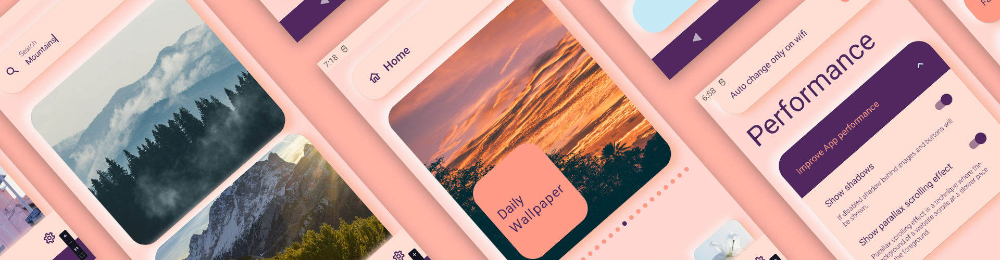

# Welcome to PexWallpapers!


Hi! PexWallpapers is one of my current projects in Jetpack Compose. 
The app use Pexels.com image library to showpictures/wallpapers in the app. 
You can browse different categories or just use **Search** to findsome beautiful wallpapers for your phone. 
If you add wallpapers to favourites than you can turn on **Auto Wallpaper Setter** in Settings, 
to have your phone wallpaper changed every specific periodof time.

This is my portfolio app. App is still in development. Main features are working.
You can set wallpapers, both home screen and lock screen.
Auto wallpapere change works great. If app gets released in the future i may adjust time periods a bit better.
You can download and share wallpapers to and add them to favorites.

# Tech Stack


* 100% [Kotlin](https://kotlinlang.org/)
*  [Coroutines](https://kotlinlang.org/docs/coroutines-overview.html) - for background operations
*  [Retrofit](https://github.com/square/retrofit) - networking
* [Room](https://developer.android.com/training/data-storage/room) - for persistence
* [ViewModel](https://developer.android.com/topic/libraries/architecture/viewmodel) - handles logic between UI and *Repository* using **Flows**
* [Jetpack Compose](https://developer.android.com/jetpack/compose) - latest reactive ui toolkit by Google
* [Paging 3](https://developer.android.com/topic/libraries/architecture/paging/v3-overview) - for displaying long Wallpaper lists from web
* [WorkManager](https://developer.android.com/topic/libraries/architecture/workmanager) - automation wallpaper change and downloading images
* [Hilt](https://developer.android.com/training/dependency-injection/hilt-android) - for dependency injection
* [Coil](https://github.com/coil-kt/coil) - for fetching images from web
* [Accompanist](https://github.com/google/accompanist) is used in a SwipeRefreshLayout
* [Shimmer](https://github.com/valentinilk/compose-shimmer) effect for while loading Wallpapers

* Modern Architecture
  * Modularity - feature layered
  * Single activity
  * [MVVM](https://en.wikipedia.org/wiki/Model%E2%80%93view%E2%80%93viewmodel) architecture
  * [Android Architecture components](https://developer.android.com/topic/libraries/architecture) ([ViewModel](https://developer.android.com/topic/libraries/architecture/viewmodel) [Compose navigation](https://developer.android.com/jetpack/compose/navigation))
  * [Android KTX](https://developer.android.com/kotlin/ktx) - Jetpack Kotlin extensions

* UI
  * [Material design](https://material.io/design)
  * Compose - reactive UI

* Testing
  * [Unit Tests](https://en.wikipedia.org/wiki/Unit_testing)
  * [UI Tests](https://en.wikipedia.org/wiki/Graphical_user_interface_testing)

* Gradle
  * [Gradle Kotlin DSL](https://docs.gradle.org/current/userguide/kotlin_dsl.html)

## Architecture

* App - this is the main module. It contains code that wires multiple modules together. Contains navigation class.
* Core - pure kotlin library.
* Domain - contains domain model of Wallpaper used across the app
* Data - this is where WallpaperDatabase is kept and network interface. Both are provided by Hilt in DataModule.
* Base - contains shared elements like BaseViewModiel and Extensions
* Components - contains app theme and collection of composabled shared across screens.
* feature_images - this feature has two main classes. 
  * ImageManager - responsible for: downloading, saving, reading and backing up wallpaper
  * WallpaperSetter - responsible for setting home and lock screen wallpaper
* feature_automation - keeps logic for all WorkManager works like: auto wallpaper change, downloading image
* feature_home:
  * data - HomeRepository's implementation which talks to DataModule
  * domain - contains HomeRepository
  * presentation - with HomeScreen and HomeScreenViewModel
* feature_search:
  * data - contains SearchRepositoryImpl and RemoteMediator
  * domain - SearchRepository
  * presentation - SearchScreen, SearchViewModel and composables used only in Search module
* feature_favorites - presentation only with sceen, composables and viewModel
* feature_preview - presentation only with sceen, composables and viewModel
* feature_settings:
  * data - Settings database with Dao 
  * domain - Settings data model
  * presentation - Settings screen with viewModiel + placeholder for PrivacyScreen
  
#

The modularized code-base approach provides few benefits:

* better separation of concerns. Each module has a clear API., Feature related classes live in different modules and can't be referenced without explicit module   dependency.
* features can be developed in parallel eg. by different teams
* each feature can be developed in isolation, independently from other features
* faster compile time


## Getting started

There are a few ways to open this project.

### Android Studio

1. `Android Studio` -> `File` -> `New` -> `From Version control` -> `Git`
2. Enter `git@github.com:adrianwitaszak/PexWallpapers.git` into URL field an press `Clone` button

### Command-line + Android Studio

1. Run `git clone git@github.com:adrianwitaszak/PexWallpapers.git` command to clone project
2. Open `Android Studio` and select `File | Open...` from the menu. Select cloned directory and press `Open` button

## First time setup

To run app:

1. git clone repo to Android studio
2. Get your own Api Key from [Pexels.com](https://www.pexels.com/api/)
3. Add your own Api Key to gradle.properties in this format

   pex_api_access_key="234f9170000324234012343d044b1a3482ba588"

4. And run in emulator or on physical device

## Contribute

Want to contribute? Check our [Contributing](CONTRIBUTING.md) docs.

## Author

[](https://twitter.com/adrianwita)

# STATUS
  * IN DEVELOPMENT

## License
```
MIT License

Copyright (c) 2019 Igor Wojda

Permission is hereby granted, free of charge, to any person obtaining a copy of this software and
associated documentation files (the "Software"), to deal in the Software without restriction, including
without limitation the rights to use, copy, modify, merge, publish, distribute, sublicense, and/or sell
copies of the Software, and to permit persons to whom the Software is furnished to do so, subject to
the following conditions:

The above copyright notice and this permission notice shall be included in all copies or substantial
portions of the Software.

THE SOFTWARE IS PROVIDED "AS IS", WITHOUT WARRANTY OF ANY KIND, EXPRESS OR IMPLIED, INCLUDING BUT NOT
LIMITED TO THE WARRANTIES OF MERCHANTABILITY, FITNESS FOR A PARTICULAR PURPOSE AND NONINFRINGEMENT. IN
NO EVENT SHALL THE AUTHORS OR COPYRIGHT HOLDERS BE LIABLE FOR ANY CLAIM, DAMAGES OR OTHER LIABILITY,
WHETHER IN AN ACTION OF  TORT OR OTHERWISE, ARISING FROM, OUT OF OR IN CONNECTION WITH THE
SOFTWARE OR THE USE OR OTHER DEALINGS IN THE SOFTWARE.
```
