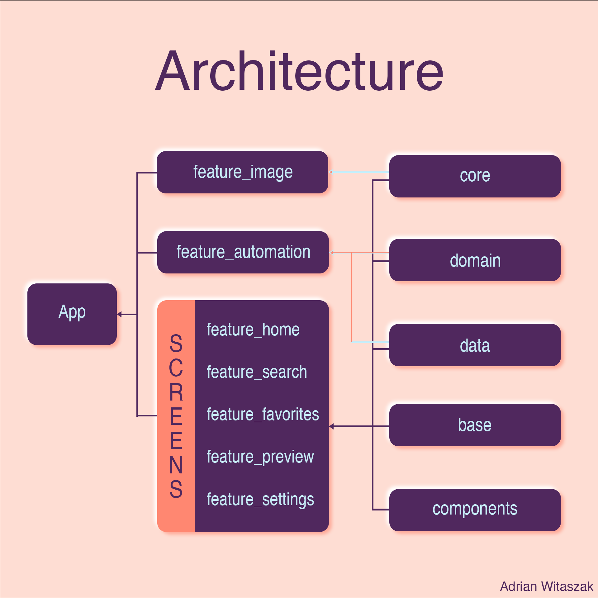

# Welcome to PexWallpapers!

Hi! PexWallpapers is one of my current projects in Jetpack Compose. 
The app use Pexels.com image library to show pictures/wallpapers in the app. 
You can browse different categories or just use **Search** to find some beautiful wallpapers for your phone. 
If you add wallpapers to favourites than you can turn on **Auto Wallpaper Setter** in Settings, 
to have your phone wallpaper changed every specific period of time.


* Tech Stack
  * 100% [Kotlin](https://kotlinlang.org/)
  *  [Coroutines](https://kotlinlang.org/docs/coroutines-overview.html) - for background operations
  *  [Retrofit](https://github.com/square/retrofit) - networking
  *  [Jetpack](https://developer.android.com/jetpack)
    * [Room](https://developer.android.com/training/data-storage/room) - for persistence
    * [ViewModel](https://developer.android.com/topic/libraries/architecture/viewmodel) - handles logic between UI and *Repository* using **Flows**
    * [Jetpack Compose](https://developer.android.com/jetpack/compose) - latest reactive ui toolkit by Google
    * [Paging 3](https://developer.android.com/topic/libraries/architecture/paging/v3-overview) - for displaying long Wallpaper lists from web
    * [WorkManager](https://developer.android.com/topic/libraries/architecture/workmanager) - automation wallpaper change and downloading images
  * [Hilt](https://developer.android.com/training/dependency-injection/hilt-android) - for dependency injection
  * [Coil](https://github.com/coil-kt/coil) - for fetching images from web
  * [Accompanist](https://github.com/google/accompanist) is used in a SwipeRefreshLayout
  * [Shimmer](https://github.com/valentinilk/compose-shimmer) effect for while loading Wallpapers

* Modern Architecture
  * Modularity - feature layered
  * Single activity
  * [MVVM](https://en.wikipedia.org/wiki/Model%E2%80%93view%E2%80%93viewmodel) architecture
  * [Android Architecture components](https://developer.android.com/topic/libraries/architecture) ([ViewModel](https://developer.android.com/topic/libraries/architecture/viewmodel) [Compose navigation](https://developer.android.com/jetpack/compose/navigation))
  * [Android KTX](https://developer.android.com/kotlin/ktx) - Jetpack Kotlin extensions

* UI
  * [Material design](https://material.io/design)
  * Compose - reactive UI

* Testing
  * [Unit Tests](https://en.wikipedia.org/wiki/Unit_testing)
  * [UI Tests](https://en.wikipedia.org/wiki/Graphical_user_interface_testing)

* Gradle
  * [Gradle Kotlin DSL](https://docs.gradle.org/current/userguide/kotlin_dsl.html)



## Getting started

There are a few ways to open this project.

### Android Studio

1. `Android Studio` -> `File` -> `New` -> `From Version control` -> `Git`
2. Enter `https://github.com/adrianwitaszak/PexWallpapers.git` into URL field an press `Clone` button

### Command-line + Android Studio

1. Run `git clone https://github.com/adrianwitaszak/PexWallpapers.git` command to clone project
2. Open `Android Studio` and select `File | Open...` from the menu. Select cloned directory and press `Open` button

# Add API key

1. git clone repo to Android studio
2. Get your own Api Key from [Pexels.com](https://www.pexels.com/api/)
3. Add your own Api Key to gradle.properties in this format

   pex_api_access_key="234f9170000324234012343d044b1a3482ba588"

4. And run in emulator or on physical device

## Contributing 🤝


[](http://makeapullrequest.com)

Read our [contributing guide](doc/CONTRIBUTING.md) and let's build a better antd together.

We welcome all contributions. Please read our [CONTRIBUTING.md](doc/CONTRIBUTING.md) first. You can submit any ideas
as [pull requests](https://github.com/adrianwitaszak/neumorph-ui/pulls) or
as [GitHub issues](https://github.com/adrianwitaszak/neumorph-ui/issues). If you'd like to improve code, check out the
Development Instructions and have a good time! :)

## Author ⭐

[](https://twitter.com/adrianwita)
@adrianwita

[](https://www.linkedin.com/in/adrian-witaszak)
@adrian-witaszak

[](https://www.buymeacoffee.com/adrianwitay)

## License 

```
MIT License

Copyright (c) 2022 Adrian Witaszak

Permission is hereby granted, free of charge, to any person obtaining a copy of this software and
associated documentation files (the "Software"), to deal in the Software without restriction, including
without limitation the rights to use, copy, modify, merge, publish, distribute, sublicense, and/or sell
copies of the Software, and to permit persons to whom the Software is furnished to do so, subject to
the following conditions:

The above copyright notice and this permission notice shall be included in all copies or substantial
portions of the Software.

THE SOFTWARE IS PROVIDED "AS IS", WITHOUT WARRANTY OF ANY KIND, EXPRESS OR IMPLIED, INCLUDING BUT NOT
LIMITED TO THE WARRANTIES OF MERCHANTABILITY, FITNESS FOR A PARTICULAR PURPOSE AND NONINFRINGEMENT. IN
NO EVENT SHALL THE AUTHORS OR COPYRIGHT HOLDERS BE LIABLE FOR ANY CLAIM, DAMAGES OR OTHER LIABILITY,
WHETHER IN AN ACTION OF  TORT OR OTHERWISE, ARISING FROM, OUT OF OR IN CONNECTION WITH THE
SOFTWARE OR THE USE OR OTHER DEALINGS IN THE SOFTWARE.
```
